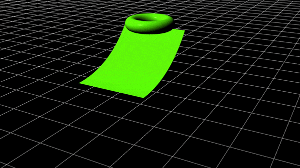
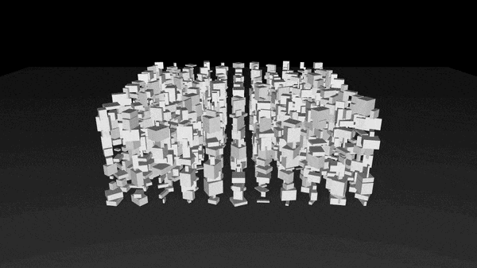
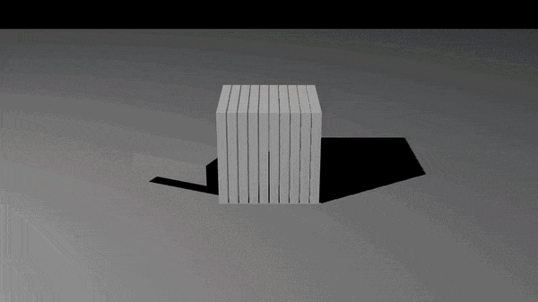
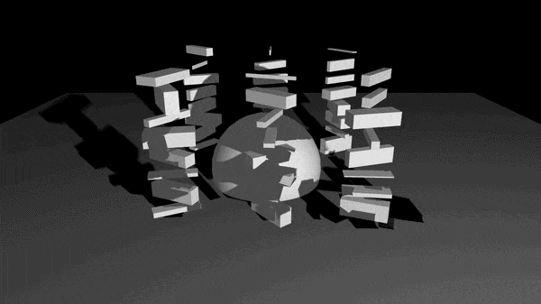
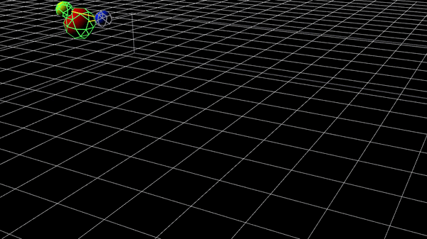
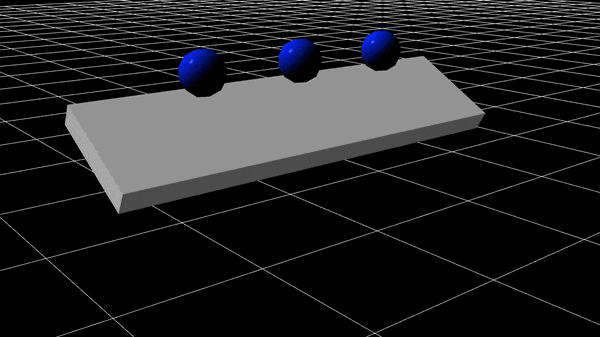

# Box3D for TouchDesigner

## Example gallery

### Custom Mesh Collider (`TD-Examples/Custom_Mesh_Collider.toe`)


### Custom Size Instances (`TD-Examples/Custom_Size_Instances.toe`)


### Instances (`TD-Examples/Instances.toe`)


### Instances and Dynamic (`TD-Examples/Instances_and_Dynamic.toe`)


### Joint (`TD-Examples/Joint.toe`)


### Restitution (`TD-Examples/Restitution.toe`)


Native TouchDesigner custom operators exposing [Box3D](https://box2d.org) — Erin Catto's
3D rigid-body physics engine — inside TD, modeled after the workflow of TD's built-in
Bullet solver: a solver node owns the world, actor nodes contribute bodies, no wiring
between them.

Current plugin release: **v0.2.5**.

## Quick DLL install (GitHub Release)

If you only want to use the plugin, download the latest DLL package from
[GitHub Releases](https://github.com/armdz/box3d_touchdesigner/releases), extract it,
and copy the DLLs to:

`%USERPROFILE%\Documents\Derivative\Plugins`

After installing the DLLs, open TouchDesigner and try one of the example scenes in
`TD-Examples/`.

> Agent/contributor context, design decisions and the phase roadmap live in
> [PLAN.md](PLAN.md) (Spanish). Read it before changing this folder.

## Node family

| Node | Family | Role |
|---|---|---|
| **Box3D Solver** (`Box3dsolver`) | CHOP | Owns one world: gravity, sub-steps, optional ground plane, optional static container walls, optional static **Collision SOP** (triangle mesh). Steps the simulation once per frame. It does not spawn bodies; body nodes feed the world. Output channels are compatibility zeros. Includes a **Reset** pulse to force a full world rebuild, and an **Allow Sleep** toggle — on by default, quiet bodies doze off to save CPU; turn it off to force every body to simulate every step (also wakes everything currently asleep). |
| **Box3D Set Joint** (`Box3dsetjoint`) | SOP | Joint-anchor helper. Passes geometry through, lets you place an anchor visually (center/tips/custom), supports an `Anchor Color` preview, and writes `joint_enabled` + `joint_pivot` attributes on the SOP output. The pivot is also encoded relative to reference points of the geometry (`joint_ref` + `joint_ref_w`), so SOPs applied between Set Joint and the Body SOP (Transform, etc.) move the joint anchor together with the geometry. |
| **Box3D Body** (`Box3dbody`) | SOP | ONE rigid body. Wire geometry in and pick a shape: **Input Hull** (convex hull of the input points), Box/Sphere/Capsule, or **Mesh (Static)** — the exact triangle mesh, concave geometry welcome (terrain, tubes, bowls), for Static/Kinematic bodies only (dynamic bodies must stay convex, an engine limit; a dynamic body with Mesh shape is treated as Static with a warning). Create as many static mesh bodies as you need. Any polygon input works (quads are fan-triangulated), and mesh collision is one-sided: the side the geometry's normals shade toward is the side that collides — flip your normals (Reverse SOP) to make an inside-out container. **Compound (Hulls)** builds one convex hull per connectivity island of the input on a single body — model a concave object in pieces (tube segments, chair legs) and it CAN be dynamic, with mass and inertia from all pieces. **Box (Container, Inward)** builds a hollow box from six thin wall slabs so collision faces INWARD — objects dropped in stay contained (a crate, bin or arena); set **Wall Thickness** and toggle **Open Top** to leave the lid off and drop things in. Unlike the Solver's world Container it can be placed, rotated and even made dynamic/kinematic (a moving box that carries its contents). Includes a **Joint** toggle with a local **Joint Pivot** and an optional **Show Joint Pivot** preview marker, so you can define the body's joint point right on the body itself. A **Show Collision Shape** toggle overlays the body's REAL collider (hull after simplification, mesh after welding) as colored wireframe lines right in the node's output. Output is the input geometry transformed by the simulation every frame — wire it straight to a render. Body transform also on its Info CHOP. For rigid upstream SOP animation (Translate/Rotate/Transform SOP), the body follows pose updates without rebuilding the whole world. Includes a **Reset** pulse to re-register this body cleanly. |
| **Box3D Instances** (`Box3dinstances`) | CHOP | A group of bodies for instancing: each point of its Spawn SOP spawns one body (per-point attributes below). The point count can change live — bodies already simulating keep their state, new points spawn new bodies, removed points remove theirs (body identity is the point index: keep point order stable and append new points at the end). Outputs `tx ty tz rx ry rz sx sy sz`, one sample per body — feed Geometry COMP instancing (RX/RY/RZ are degrees, TD rotate order XYZ; SX/SY/SZ are always positive, with a small safety clamp to avoid degenerate render scales). Includes a **Reset** pulse to re-register this group cleanly. |
| **Box3D Debug** (`Box3ddebug`) | SOP | Debug draw of the live collision world (Bullet-style). Outputs the REAL shapes box3d collides with — hulls after the 64-vertex simplification, meshes after welding — as world-space wireframe lines at the live body poses, colored by state: dynamic awake green, asleep blue, kinematic orange, static gray, ground/walls/collision mesh dark gray, joints yellow. Toggles for Bodies / World Collision / Joints. Use it standalone with Display ON and Render OFF: visible in the viewport, absent from Render TOPs. |
| **Box3D Force** (`Box3dforce`) | CHOP | Force fields for the simulation. Pick a **Type** — Attractor (pull toward a point), Repulsor (push away), Wind (constant directional force) or Vortex (swirl around an axis) — and the core applies it to dynamic bodies every step. Place it at a **Position**, or feed a **Points SOP** so every point becomes its own attractor at once (a field of wells). **Strength** (negative flips attract/repel), **Radius** (0 = infinite reach) and **Falloff** (none / linear / inverse-square) shape the field; **Mass Independent** (on) accelerates every body equally like gravity, off applies raw force so heavy bodies resist. Target all dynamic bodies or restrict to one Body SOP / Instances node via the **Bodies** filter. No wiring into the bodies needed — like the other nodes it binds to the solver by path. |
| **Box3D Contacts** (`Box3dcontacts`) | CHOP | Collision events. One sample per event captured during the solver's last step: `kind` (0 begin touch, 1 end touch, 2 hit), the body index on each side (`idxa`/`idxb`, with `worlda`/`worldb` = 1 when that side is the ground/walls/Collision SOP mesh), the world-space contact point (`px py pz`), the contact normal A→B (`nx ny nz`) and the impact `speed` (hit events, m/s — tune sensitivity with the Solver's **Hit Speed Threshold**). Toggles select which event kinds to output, and an optional **Body Filter** (path or name of a Body SOP / Instances CHOP) keeps only events involving that node, normalized so it is always side A — `idxa` then indexes straight into its instances. The Info DAT lists the same events with full node paths; the Info CHOP reports per-kind counts. Events last exactly one frame — perfect to trigger sounds, flashes or particle bursts at impact points. |
| **Box3D Ragdoll** (`Box3dragdoll`) | SOP | One-node humanoid ragdoll. Generates 11 capsule bones (pelvis, spine, head, upper arms, forearms, thighs, shins) and the 10 joints that articulate them — spherical with anatomical cone/twist limits for hips/shoulders/neck/spine, hinges with limits for knees/elbows. Drop it next to a Solver and it just works: the output is the capsule geometry transformed by the simulation every frame (wire straight to a render), or switch **Output** to Points to get one point per bone with `orient` (quaternion), `scale` and `bone` attributes for SOP-based instancing. **Height** scales the whole body, **Bulk** the bone thickness, **Stiffness/Damping** add muscle-tone springs (0 = fully floppy), **Anatomical Limits** can be toggled off. Position/Rotate place the spawn T-pose (dynamic bodies take the spawn pose at creation — press **Reset** to respawn). |
| **Box3D Joint CHOP** (`Box3djointchop`) | CHOP | The joint authoring node. Connects bodies by path/name plus index and uses the joint pivot stored on each Body SOP: set the pivot on the bodies, then connect Body A and Body B (leave Body B empty to pin Body A to the world). The **Joints** parameter enables up to 8 Body A/Body B pair rows on the Bodies page (Constant CHOP style), and **Count** turns each pair into an index series for chains. The **Pivot** menu picks how the anchor is placed: each body's own pivot (default, pivot-to-pivot), one body's pivot for both sides (**Body B Pivot** is the ragdoll convention — the child bone carries the anchor, so bones jointed on both ends articulate correctly with a single pivot each), or an explicit world-space **Anchor**. Outputs `ax ay az bx by bz active`, one sample per joint. |

Body and Instances nodes bind to a solver through their **Solver** path parameter.
Reading the solver creates the cook dependency, so TD always steps the world before the
actors cook — no wires needed. All groups interact in the same world. The parameter
defaults to `Box3dsolver1`, so nodes created next to a solver with TD's default name
bind automatically; rename or point it elsewhere for multiple worlds.

Solver, Body, Instances and Joint nodes cook every frame on their own (no viewer or
wire needed) — a body exists in the world because its node cooks. **Bypassing a node
removes its bodies/joints from the simulation within a few frames**, and un-bypassing
respawns them; bypassing the Solver pauses the whole world.

When a Body SOP input contains custom attributes `joint_enabled` and/or `joint_pivot` (for example from **Box3D Set Joint**), the Body SOP uses those values automatically and treats the manual Joint controls as overridden. `joint_pivot` is interpreted in the input/object space and converted internally to body-local space. When the companion `joint_ref` / `joint_ref_w` attributes are present, the pivot is rebuilt from the current (transformed) point positions instead of the static `joint_pivot` value, so a Transform SOP between Set Joint and the Body carries the anchor along — translation, rotation and scale included.

## Joint Parameters

### Box3D Body joint settings

| Parameter | What it does |
|---|---|
| **Joint** | Enables a local pivot for this body. When off, the body origin is used. |
| **Joint Pivot** | Local body-space pivot position. This is the point the Joint node will use when Body A or Body B points to this body. |
| **Show Joint Pivot** | Draws a small pivot marker in the Body SOP preview so you can see where the joint anchor is. |

### Box3D Joint CHOP settings

| Parameter | What it does |
|---|---|
| **Solver** | Box3D Solver CHOP that owns the world this joint belongs to. |
| **Type** | Joint type: `distance`, `spherical`, `revolute`, or `weld`. |
| **Joints** | How many Body A/Body B pair rows are active (1–8, on the Bodies page). Like the Constant CHOP: raise it for more rows, lower it to disable them. |
| **Count (per pair)** | Turns each pair into a series of joints: joint *i* uses Index A + *i* (and Index B + *i* when Body B is set). Handy for chains over an Instances CHOP group. |
| **Body A 1..8** | Path or node name of the first body owner node. Use the same name/path the Body SOP or Instances CHOP is registered with. |
| **Index A 1..8** | Body index inside Body A's group. Use `0` for a single Body SOP. |
| **Body B 1..8** | Path or node name of the second body owner node. Leave empty to anchor Body A to the world. |
| **Index B 1..8** | Body index inside Body B's group. Use `0` for a single Body SOP. |
| **Axis** | Joint frame axis in world space. For revolute this is the hinge axis; for spherical this is the cone axis. |
| **Connected Bodies Collide** | Lets the two connected bodies keep colliding with each other. |
| **Spring Hertz** | Spring stiffness in Hz. `0` disables spring behavior. |
| **Spring Damping** | Spring damping ratio. |
| **Auto Length (Distance)** | For distance joints, use the current separation as the joint length at creation time. |
| **Length** | Distance joint target length when Auto Length is off. |
| **Enable Limit** | Enables limits. For distance joints it uses min/max length; for revolute it uses angular limits. |
| **Lower Angle (deg)** | Lower revolute or twist limit in degrees. |
| **Upper Angle (deg)** | Upper revolute or twist limit in degrees. |
| **Min Length** | Minimum distance limit when Enable Limit is on for a distance joint. |
| **Max Length** | Maximum distance limit when Enable Limit is on for a distance joint. |
| **Enable Cone Limit** | Enables the cone limit for spherical joints. |
| **Cone Angle (deg)** | Cone angle for spherical joints. |
| **Enable Motor** | Enables the motor on distance or revolute joints. |
| **Motor Speed (deg/s | units/s)** | Motor speed. Revolute uses degrees per second, distance uses units per second. |
| **Max Motor Torque / Force** | Maximum torque for revolute or force for distance joints. |

Notes:

- The Joint CHOP is intentionally simple: it only connects bodies. The pivot lives in the Body SOP.
- Two-body joints are pivot-to-pivot: each body's own joint pivot is the constraint point, and the solver pulls the two pivots together when the joint is created. Bodies do not need to spawn aligned or touching — place the pivots where the joint should be and the sim snaps them together.
- For two boxes joined at the tip, enable **Joint** on both Body SOPs, set the same **Joint Pivot** on both, and use a **Weld** or **Revolute** joint.
- If Body B is empty, the joint anchors Body A to the world.

### Spawn SOP per-point attributes (all optional, float or int)

| Attribute | Comps | Meaning |
|---|---|---|
| `shape` | 1 | 0=box, 1=sphere, 2=capsule |
| `size` | 1–3 | FULL sizes; box: x,y,z · sphere: x=diameter · capsule: x=diameter, y=total height (Y axis) |
| `size0/size1/size2` | 1 each | Alias form for split size components |
| `sizex/sizey/sizez` | 1 each | Alias form for split size components |
| `sx/sy/sz` | 1 each | Alias form for split size components |
| `density` | 1 | mass density |
| `friction` | 1 | Coulomb friction |
| `restitution` | 1 | bounciness |
| `type` | 1 | 0=static, 1=kinematic, 2=dynamic (default) |
| `bullet` | 1 | 1 = continuous collision (CCD) for this fast-moving dynamic body |
| `orient` | 4 | initial rotation quaternion x y z w |
| `rx/ry/rz` | 1 each | initial rotation in degrees (used when `orient` is missing) |

Missing attributes fall back to the node's default parameters.

Notes:

- `size` is interpreted as full extents/diameter, and current defaults are unit-sized (`1,1,1`).
- Body/Instances updates are automatic. There is no "Reset On Input Change" toggle for body spawn groups.
- Use each node's **Reset** pulse when a specific body/group needs a clean rebind without changing SOP inputs.

## Building (Windows x64)

Requirements: Visual Studio 2022 (MSVC), CMake ≥ 3.22, git.

```
cmake -B build
cmake --build build --config Release
```

Box3D sources are resolved automatically: a sibling `../box3d` checkout is used if
present, otherwise CMake fetches the engine from GitHub pinned to a known-good commit
(`BOX3D_GIT_TAG`). You can also point at any checkout with
`-DBOX3D_SOURCE_DIR=<path>`.

Output goes to `plugin/`:

- `Box3DCore.dll` — shared core: the Box3D engine (statically linked inside) plus the
  world registry that the operator DLLs share. Must sit next to the plugin DLLs.
- `Box3DSolverCHOP.dll`, `Box3DBodySOP.dll`, `Box3DBodiesCHOP.dll` — one custom operator
  per DLL (a TouchDesigner constraint).

## Building (macOS, arm64/x86_64)

Requirements: Xcode Command Line Tools (`clang`), CMake ≥ 3.22, git.

```
cmake -B build
cmake --build build --config Release
```

Same box3d source resolution as Windows (`../box3d` sibling checkout, `BOX3D_GIT_TAG`
fetch, or `-DBOX3D_SOURCE_DIR=<path>`). The deployment target defaults to macOS 13.0 to
match TouchDesigner's own minimum. For a universal (Intel + Apple Silicon) build, add
`-DCMAKE_OSX_ARCHITECTURES="arm64;x86_64"`.

Output goes to `plugin/`:

- `libBox3DCore.dylib` — shared core, equivalent to `Box3DCore.dll` above. Must sit next
  to the plugin bundles: they load it through an `@loader_path`-relative rpath so all
  three operators share one loaded instance (and therefore one world registry) instead
  of three isolated copies.
- `Box3DSolverCHOP.plugin`, `Box3DBodySOP.plugin`, `Box3DBodiesCHOP.plugin` — one custom
  operator bundle each.

## Installing

**Windows**: close TouchDesigner (it locks loaded DLLs), then run:

```
install_plugin.bat
```

This copies every DLL from `plugin/` to
`%USERPROFILE%\Documents\Derivative\Plugins`.

**macOS**: close TouchDesigner, then run:

```
./install_plugin.sh
```

This copies the `.plugin` bundles and `libBox3DCore.dylib` from `plugin/` to
`~/Library/Application Support/Derivative/TouchDesigner099/Plugins` (that folder name is
correct as shipped by Derivative — it isn't tied to the TD version you have installed).
On first load TD will ask you to confirm loading each new/changed binary; this is normal
for any Custom OP. If you plan to distribute a prebuilt macOS package instead of building
locally, note that a downloaded (quarantined) unsigned bundle will trigger a Gatekeeper
warning — codesigning/notarizing is out of scope here but something to add before a
public macOS release.

Reopen TD and the operators appear in the OP Create dialog (Custom family). You can then
open one of the example scenes in `TD-Examples/` to see a ready-to-run setup.

## Quick start

1. Drop a **Box3D Solver** CHOP and configure world settings (gravity/external accel/sub-steps/max steps per cook/ground/container/collision).
2. Drop a Box SOP, deform it, wire it into a **Box3D Body** SOP, set its Solver parameter
   to the solver node, Shape = Input Hull, and wire the Body to a Geometry COMP. Play.
3. For crowds: make a Grid SOP, point a **Box3D Instances** CHOP at it (Spawn SOP) and at
  the solver, then instance a Geometry COMP from its channels
  (TX/TY/TZ ← `tx ty tz`, RX/RY/RZ ← `rx ry rz`, SX/SY/SZ ← `sx sy sz`).

## Behavior updates

- Solver is world-only: no solver-owned demo spawn, no solver-owned actor output.
- Solver exposes `External Accel` and `Max Steps / Cook` for extra control over force fields and catch-up precision.
- Group updates are local when possible:
  - pose-only updates move existing bodies in-place,
  - incompatible body changes (shape/material/count/hull) recreate only that group.
- Instances can use a material preset (`Custom`, `Soft`, `Medium`, `Bouncy`) to quickly set default density/friction/restitution.
- Kinematic bodies are driven with target transforms (not pure teleports), improving
  contacts against dynamic bodies when externally animated.
- Body and Instances include a local **Reset** pulse, separate from Solver reset.
- Body SOP preserves shading better when possible by respecting normal attribute sets
  and avoiding extra normal rotation in rigid input-follow mode.

- Contact events: enable **Contact Channels** on Box3D Instances to get per-instance
  `touching` (live contact count), `impulse` (summed normal impulse) and `hitspeed`
  (strongest impact this frame, nonzero for one frame) — great drivers for color flashes
  or audio triggers. The Body SOP Info CHOP exposes the same three channels, the Solver
  Info CHOP reports `contact_events`, and the **Box3D Contacts** CHOP streams the full
  event list (with impact points and normals for spawning particles/decals).

## Repo layout

```
repo root
  README.md              this file
  PLAN.md                project context, decisions, roadmap (for humans and AI agents)
  CMakeLists.txt         standalone top-level project (do NOT build via the box3d root)
  common/                Box3DCore shared DLL sources + header-only TD helpers
  Box3DSolverCHOP/       solver operator
  Box3DBodySOP/          single-body operator
  Box3DBodiesCHOP/       instances operator
  sdk/                   TouchDesigner CPlusPlus SDK headers (Derivative Shared Use License)
  install_plugin.bat     Windows: copies built DLLs into the TD Plugins folder
  install_plugin.sh      macOS: copies built .plugin bundles + dylib into the TD Plugins folder
  TD-Examples/           TouchDesigner example files and demo scenes
  build/                 CMake build dir (gitignored)
  plugin/                built plugin binaries (gitignored)
```

## Build notes / gotchas

- **MSVC runtime**: box3d's own root CMake forces the static runtime (`/MT`); TD plugin
  DLLs must use the dynamic runtime (`/MD`). That is why this project adds box3d's
  `src/` directory directly and never includes box3d's root CMakeLists.
- **macOS rpath**: the operator bundles link `libBox3DCore.dylib` with an
  `@loader_path/../../../` rpath (set via `INSTALL_RPATH` + `BUILD_WITH_INSTALL_RPATH` in
  `CMakeLists.txt`), not the more common `@loader_path/../Frameworks` + embedded-per-bundle
  pattern from Derivative's own docs. That per-bundle pattern would give each of the three
  `.plugin` bundles its own private copy of the dylib — three separate loaded images with
  three separate world registries, breaking the whole point of the shared core. The rpath
  used here resolves to one shared file next to the bundles, exactly like `Box3DCore.dll`
  next to the plugin DLLs on Windows.
- **macOS deployment target**: pinned to `13.0` in `CMakeLists.txt` (matches TD's own
  binary) instead of inheriting whatever newer SDK a local Xcode/CLT install defaults to,
  which would otherwise make the plugin refuse to load on older-but-still-supported macOS
  versions.
- **Fixed timestep**: the world steps at a fixed 60 Hz with an accumulator over TD's cook
  delta; `Max Steps / Cook` caps catch-up work to avoid spirals while still allowing better
  collision robustness under load.
- **Mesh lifetime**: Box3D references (does not copy) collision mesh data; the core keeps
  it alive and destroys it only after the world.
- Simulation is CPU (Box3D). The Solver `Workers` parameter maps to Box3D worker count.

## Performance tips

- Start with `Sub Steps = 4..8`, then increase only if needed.
- Raise `Max Steps / Cook` when fast bodies tunnel during frame drops or heavy scenes.
- Increase `Workers` on CPUs with real performance cores for collision-heavy scenes.
- For large crowds, prefer primitive colliders (box/sphere/capsule) over dense hulls.

## Licenses

- Box3D: MIT (c) Erin Catto — this folder builds it from the repository sources.
- `sdk/` headers: Derivative Inc. Shared Use License — usable only with TouchDesigner.
- Plugin code in this folder: MIT unless noted otherwise.
